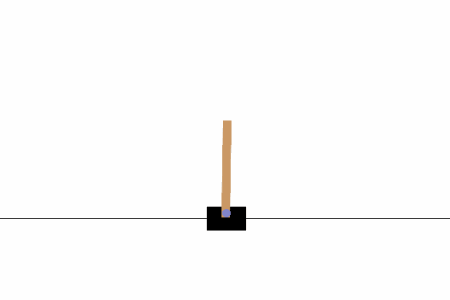
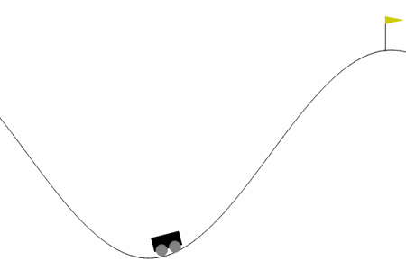
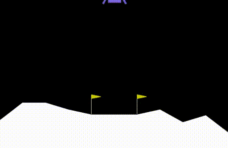

# PyEvo
PyEvo is a simple Python Framework for using Evolutionary Algorithm to solve Optimization Problems like 
Hyperparameter Optimization (HPO) or Neuroevolution Tasks.
Here you can find more information about
[Evolutionary Algorithm](https://en.wikipedia.org/wiki/Evolutionary_algorithm), 
[HPO Tasks](https://en.wikipedia.org/wiki/Hyperparameter_optimization) or 
[Neuroevolution](https://en.wikipedia.org/wiki/Neuroevolution).

<p align="center">
    
    
    
</p>

### Solving Optimization problems with PyEvo
In the following we want to solve a Neuroevolution problem.
We want to train an agent on the
[Lunar-Lander-v2 environment](https://gymnasium.farama.org/environments/box2d/lunar_lander/) from Gymnasium.

First we have to define our Optimization problem as a function for using it in PyEvo.
First you have to define your individuals with a `HyperparameterConfigurationSpace`:
```python
from PyHyperparameterSpace.space import HyperparameterConfigurationSpace
from PyHyperparameterSpace.hp.continuous import Float
from PyHyperparameterSpace.hp.constant import Constant

# Construct a Hyperparameter Configuration Space
cs = HyperparameterConfigurationSpace(
    values={
        "seed": Constant("seed", default=0),
        "max_episodes": Constant("max_episodes", default=10),
        "max_episode_length": Constant("max_episode_length", default=1000),
        "hidden1_shape": Constant("hidden1_shape", default=64),
        "hidden2_shape": Constant("hidden2_shape", default=64),
        "hidden3_shape": Constant("hidden3_shape", default=64),
        "fc1.weight": Float("fc1.weight", bounds=(-1.0, 1.0), shape=(64, 8)),
        "fc1.bias": Float("fc1.bias", bounds=(-1.0, 1.0), shape=(64,)),
        "fc2.weight": Float("fc2.weight", bounds=(-1.0, 1.0), shape=(64, 64)),
        "fc2.bias": Float("fc2.bias", bounds=(-1.0, 1.0), shape=(64,)),
        "fc3.weight": Float("fc3.weight", bounds=(-1.0, 1.0), shape=(64, 64)),
        "fc3.bias": Float("fc3.bias", bounds=(-1.0, 1.0), shape=(64,)),
        "fc4.weight": Float("fc4.weight", bounds=(-1.0, 1.0), shape=(4, 64)),
        "fc4.bias": Float("fc4.bias", bounds=(-1.0, 1.0), shape=(4,)),
    },
    seed=0,
)
```

Each optimization problem is defined as a function, that uses a `HyperparameterConfiguration` and returns a `float` 
metric:
```python
import gymnasium as gym
import torch.nn.functional as F
import torch.nn as nn
import numpy as np
import torch

class ExampleNet(nn.Module):
    """ Neural Network we want to optimize. """

    def __init__(
            self,
            observation_shape: tuple[int, ...],
            action_shape: int,
            cfg: HyperparameterConfiguration,
    ):
        super().__init__()

        # Extract the important hps
        hidden1_shape = cfg["hidden1_shape"]
        hidden2_shape = cfg["hidden2_shape"]
        hidden3_shape = cfg["hidden3_shape"]
        fc1_weight = torch.from_numpy(cfg["fc1.weight"]).to(dtype=torch.float32)
        fc1_bias = torch.from_numpy(cfg["fc1.bias"]).to(dtype=torch.float32)
        fc2_weight = torch.from_numpy(cfg["fc2.weight"]).to(dtype=torch.float32)
        fc2_bias = torch.from_numpy(cfg["fc2.bias"]).to(dtype=torch.float32)
        fc3_weight = torch.from_numpy(cfg["fc3.weight"]).to(dtype=torch.float32)
        fc3_bias = torch.from_numpy(cfg["fc3.bias"]).to(dtype=torch.float32)
        fc4_weight = torch.from_numpy(cfg["fc4.weight"]).to(dtype=torch.float32)
        fc4_bias = torch.from_numpy(cfg["fc4.bias"]).to(dtype=torch.float32)

        self.fc1 = nn.Linear(in_features=np.prod(observation_shape), out_features=hidden1_shape)
        self.fc2 = nn.Linear(in_features=hidden1_shape, out_features=hidden2_shape)
        self.fc3 = nn.Linear(in_features=hidden2_shape, out_features=hidden3_shape)
        self.fc4 = nn.Linear(in_features=hidden3_shape, out_features=action_shape)

        # Change the weights to the desired parameters
        self.fc1.weight = nn.Parameter(fc1_weight)
        self.fc1.bias = nn.Parameter(fc1_bias)
        self.fc2.weight = nn.Parameter(fc2_weight)
        self.fc2.bias = nn.Parameter(fc2_bias)
        self.fc3.weight = nn.Parameter(fc3_weight)
        self.fc3.bias = nn.Parameter(fc3_bias)
        self.fc4.weight = nn.Parameter(fc4_weight)
        self.fc4.bias = nn.Parameter(fc4_bias)

    def forward(self, x: torch.Tensor):
        """ Forward pass of the Neural Network. """
        return self.fc4(F.relu(self.fc3(F.relu(self.fc2(F.relu(self.fc1(x)))))))

def optimization_problem(cfg: HyperparameterConfiguration, render: bool = False) -> float:
    """
    Our optimization problem, where we want to find a good weight configuration
    to solve the LunarLander-v2 environment from Gymnasium.
    
    Args:
        cfg (HyperparameterConfiguration):
            Individual we want to evaluate

        render (bool):
            If True, it renders the environment for visual feedback

    Returns:
        float:
            Score of the agent by interacting with the environment
    """
    # Extract important parameters from configuration
    max_episodes = cfg["max_episodes"]
    max_episode_length = cfg["max_episode_length"]

    # Create the environment
    env = gym.make("LunarLander-v2") if not render else gym.make("LunarLander-v2", render_mode="human")

    # Create the model with the given weights
    model = ExampleNet(
        observation_shape=env.observation_space.shape,
        action_shape=env.action_space.n,
        cfg=cfg,
    )
    
    # Typical gymnasium loop to interact with the environment
    rewards = []
    for generation in range(max_episodes):
        observation, info = env.reset()
        state = torch.tensor(observation)
        acc_reward = 0.0
        for _ in range(max_episode_length):
            # Get the next action
            q_values = model.forward(state)
            action = torch.argmax(q_values).item()

            # Do a step on the environment
            observation, reward, terminated, truncated, info = env.step(action)
            next_state = torch.tensor(observation)
            acc_reward += reward

            # Update the state
            state = next_state

            if render:
                env.render()

            if terminated or truncated:
                break
        rewards += [acc_reward]
    return np.mean(rewards)
```

Now you can define the Evolutionary Algorithm to solve such an optimization problem:
```python
from PyEvo.ea import EA
from PyEvo.selection import TournamentSelection
from PyEvo.crossover import IntermediateCrossover
from PyEvo.mutation import AdaptiveGaussianMutation

EA = EA(
    problem=optimization_problem,
    cs=cs,
    pop_size=32,
    selection_factor=2,
    n_iter=None,
    walltime_limit=1200,
    n_cores=16,
    seed=0,
    optimizer="max",
    selections=TournamentSelection(),
    crossovers=IntermediateCrossover(),
    mutations=AdaptiveGaussianMutation(
        threshold=0.3,
        alpha=0.95,
        n_generations=3,
        initial_loc=0.0,
        initial_scale=1.0,
        initial_prob=1.0,
    ),
)
```

With the `.fit()` method you can start the optimization process, where the EA tries to find a good solution for the
given optimization problem:
```python
EA.fit()
```

With the `.incumbent()` method you can use the best founded configuration for the given optimization problem.
```python
incumbent = EA.incumbent

# Verify the performance of the incumbent
reward = optimization_problem(incumbent, render=True)
print(f"Reward: {reward}")
```

### Future Features
The following list defines features, that are currently on work:

* [ ] Adjust EA class for multi-objective optimization
* [x] Make it possible to do another .fit() after trained before (local search)
* [ ] Maybe: Implement own fitness class, where we define the functions for computing statistics ?
* [ ] Self adaptive mutation based on CMA-ES
* [x] Self adaptive mutation/selection/crossover (added self-adaptation for gaussian/uniform mutation)
* [ ] Add more selection types (e. g.: Fitness proportional selection)
* [ ] Add more mutation types
* [ ] Add more crossover types
  